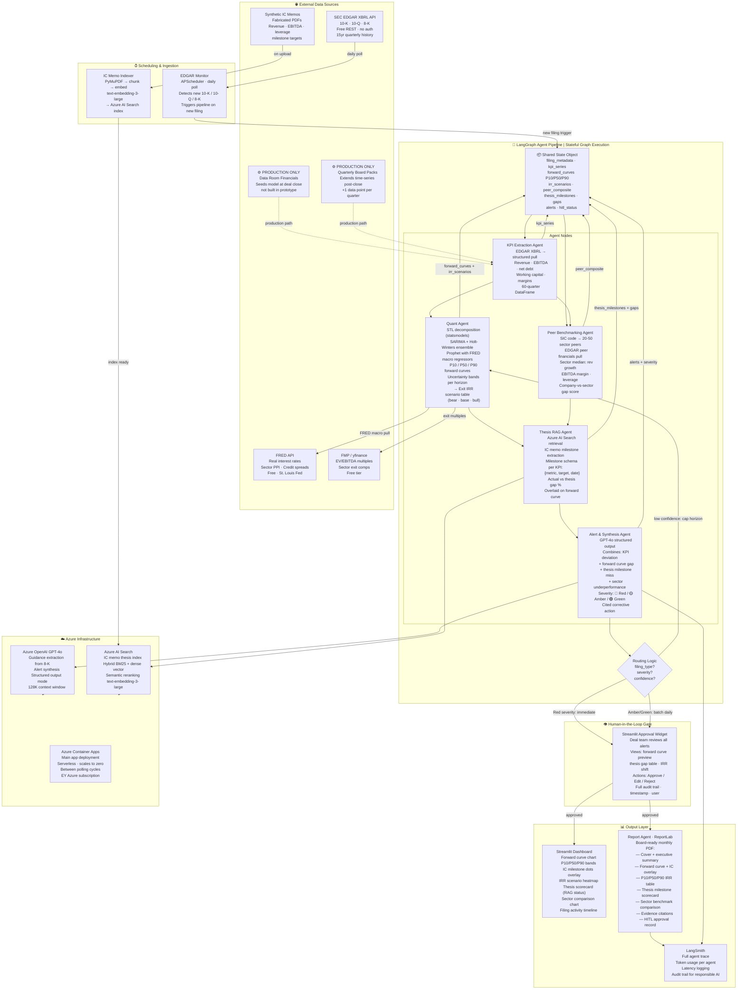
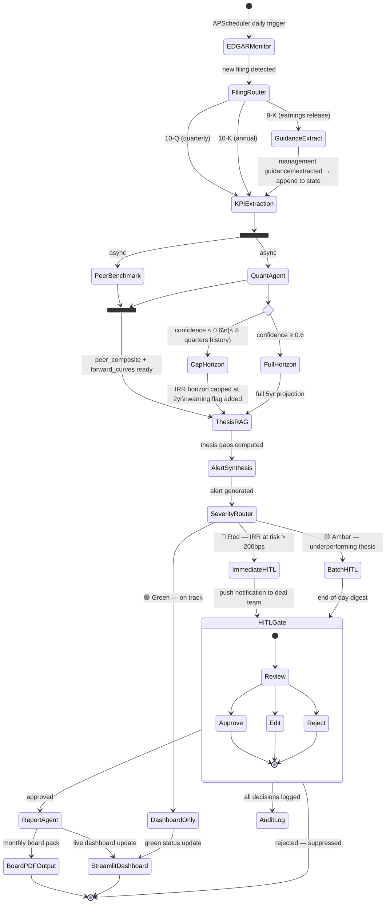
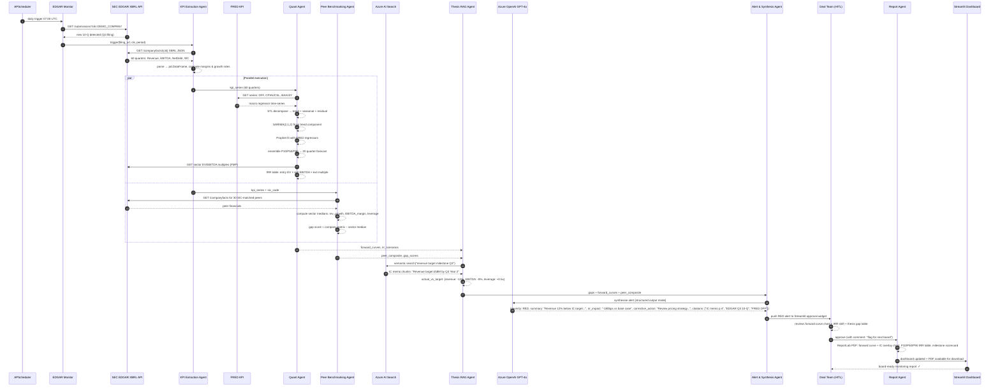

# PE Value Creation Copilot — System Architecture

---

## Diagram 1: Full System Architecture

---

## Diagram 2: LangGraph Agent State Machine (Internal Flow)

---

## Diagram 3: Demo Scenario — End-to-End Data Flow

---

## Component Reference

| Component | Technology | Purpose |
|---|---|---|
| EDGAR Monitor | Python · APScheduler | Daily poll for new 10-K/10-Q/8-K across portfolio watchlist |
| KPI Extraction Agent | SEC EDGAR XBRL REST API · pandas | Structured financial pull — no PDF parsing. Revenue, EBITDA, net debt, WC across 60 quarters |
| Quant Agent | statsmodels · Prophet · pandas | STL decomp + SARIMA + Prophet ensemble. P10/P50/P90 projections. IRR scenario table |
| Peer Benchmarking Agent | EDGAR XBRL · SIC lookup | 20–50 sector peers, quarterly medians, company vs sector gap score |
| Thesis RAG Agent | Azure AI Search · text-embedding-3-large | Semantic retrieval of IC memo milestones. Actual vs target gap computation |
| Alert & Synthesis Agent | Azure OpenAI GPT-4o (structured output) | Multi-signal synthesis. Severity classification. Cited corrective actions |
| HITL Gate | Streamlit modal widget | Deal team approval before any output reaches partners or client boards |
| Report Agent | ReportLab · Plotly | Board-ready PDF: forward curve + IC overlay, IRR table, scorecard, evidence trail |
| Dashboard | Streamlit · Plotly | Live: forward curve chart, IRR heatmap, thesis scorecard, sector comparison |
| Observability | LangSmith | Full agent trace, token usage, latency, audit log |
| Search Index | Azure AI Search (hybrid BM25 + dense) | IC memo thesis corpus, semantic reranking |
| LLM | Azure OpenAI GPT-4o | Guidance extraction from 8-K, alert synthesis, structured JSON output |
| Infra | Azure Container Apps | Serverless deployment, EY Azure subscription, auto-scales to zero |

---

## Key Design Decisions

**Why EDGAR XBRL, not PDF parsing?**
XBRL is structured JSON served via REST — revenue, EBITDA, and 200+ financial tags extracted in a single API call with no parsing errors, no OCR, no ambiguity. 15 years of quarterly history free with no authentication. PDF parsing is the production path for private company board packs and is scoped but not built in the prototype.

**Why an ensemble Quant model, not just trend extrapolation?**
A single SARIMA or naive trend line gives a point forecast with no uncertainty quantification. PE deal teams need to understand downside scenarios (P10) to assess covenant risk, and upside (P90) for LP communication. The STL + SARIMA + Prophet ensemble with macro regressors (FRED) gives statistically grounded confidence intervals, not arbitrary ±10% bands.

**Why HITL before every output?**
A miscalibrated forward curve or a wrong thesis gap reaching a client board pack is a reputational risk. The HITL gate is not an optional feature — it is the architectural boundary between AI analysis and human-approved output. Every approval is logged with timestamp, user, and rationale.

**LangGraph over a simple chain?**
Conditional routing is needed: 8-K filings require guidance extraction before KPI processing; low-confidence models should cap their forecast horizon; Red alerts bypass batch processing for immediate review. LangGraph's stateful graph supports this; a simple chain does not.

flowchart LR
    A["Data Sources SEC EDGAR XBRL IC Memo / Thesis Docs FRED Macro Data Peer Financials Production: Board Packs"] 
    --> B["Ingestion & Normalization EDGAR Monitor KPI Extraction IC Memo Indexing"]

    B --> C["Agentic Intelligence Layer KPI Agent Quant Agent Peer Benchmarking Agent Thesis RAG Agent Alert Synthesis Agent"]

    C --> D["Human Review Gate Deal team reviews Approve / Edit / Reject Audit trail"]

    D --> E["Outputs Dashboard Forward Curve + IC Overlay IRR Scenario Table Board-ready Report"]

    F["Azure Infrastructure Azure OpenAI Azure AI Search Azure Container Apps LangSmith"] -.supports.-> C
    F -.supports.-> E