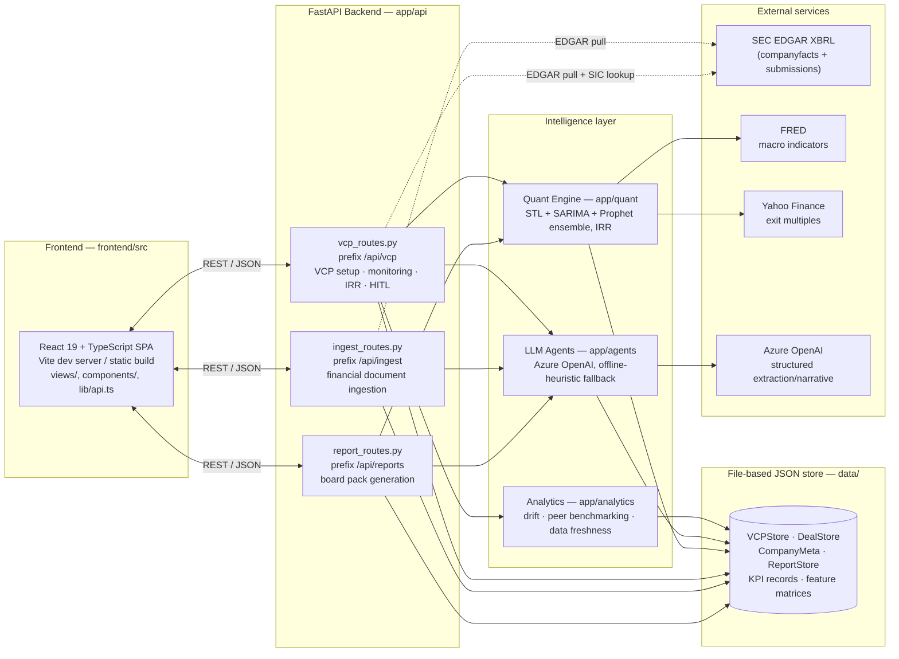
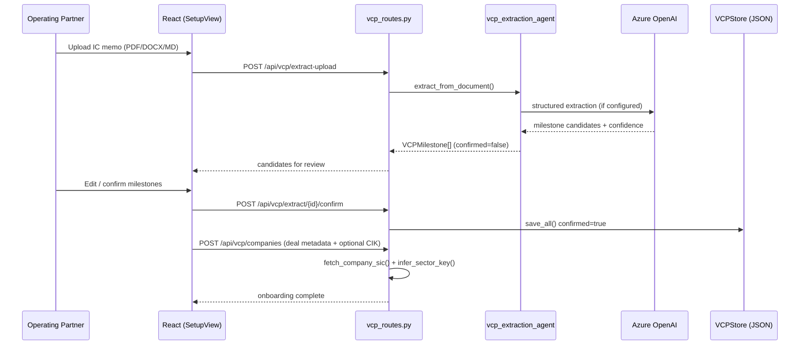
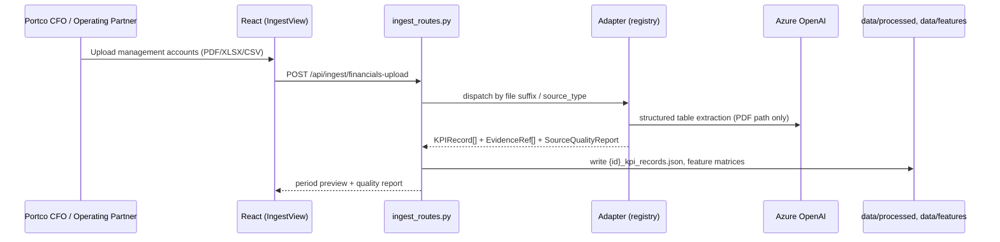
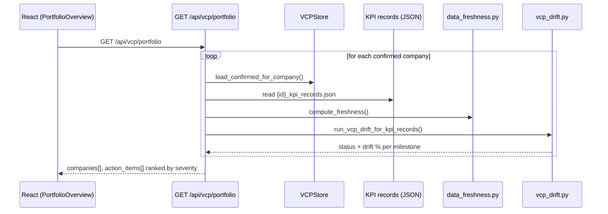
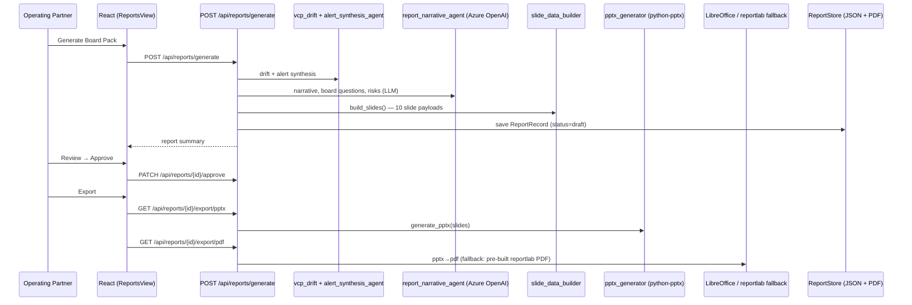
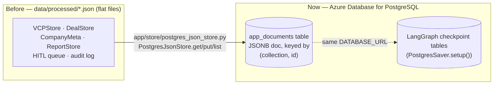

# PE Value Creation Copilot — Architecture

> **Status of this document**: rewritten 2026-07-05 from a full route-by-route,
> file-by-file audit of the codebase as it exists today. It supersedes the earlier
> aspirational version of this file (Streamlit / LangGraph orchestration / Azure AI
> Search RAG / APScheduler polling) — those pieces were part of the original design
> but were never built, or were built and later orphaned. Section 7 explicitly
> separates **implemented today** from **planned** so it stays trustworthy as the
> Azure/LangSmith migration proceeds.

---

## 1. What this system does

A private equity firm's investment thesis (the "Value Creation Plan", or **VCP**) is
a set of forward-looking commitments made at deal close — revenue growth, EBITDA
margin expansion, leverage paydown, specific operational milestones ("hire a CRO by
Q2"). This app:

1. **Extracts** those commitments from an IC memo into structured, dated,
   confidence-scored milestones (once, at deal close).
2. **Monitors** portfolio company financials against those milestones continuously
   as new data arrives (management accounts, board packs, EDGAR filings for
   take-privates).
3. **Detects drift** — where actuals diverge from the plan — and quantifies the
   impact on exit IRR using a statistical forecast ensemble.
4. **Routes findings through a human-in-the-loop (HITL) review** before anything
   reaches an operating partner's action list or a board pack.
5. **Generates board-ready reports** (PPTX + PDF) from the same live data.

---

## 2. High-level architecture

**No message queue, no scheduler, no orchestration framework in the live path.**
Every backend route computes its answer synchronously from JSON files on disk at
request time — there is no background job that pre-computes drift or IRR. This is
deliberate (see §6) but is also exactly what the planned Azure migration (§7) needs
to preserve or consciously change.

---

## 3. The two-path onboarding model

The system separates two kinds of input, on two different cadences (this split is
literally in the code comments, not just a doc convention):

| | **Path 1 — VCP Setup** | **Path 2 — Financial Monitoring** |
|---|---|---|
| Cadence | Once, at deal close (or re-run to amend) | Recurring, every reporting period |
| Input | IC memo (PDF/DOCX/MD) | Management accounts, QPRs, EDGAR filings |
| Route | `POST /api/vcp/extract-upload` → `POST /api/vcp/extract/{id}/confirm` | `POST /api/ingest/financials-upload` |
| Output | Confirmed `VCPMilestone[]` in `VCPStore` | Normalized `KPIRecord[]` in `data/processed/{id}_kpi_records.json` |
| Human gate | Operating partner edits/confirms milestones before they lock | None at ingestion; HITL applies later, at the alert stage |

---

## 4. Backend module map

| Folder | Purpose |
|---|---|
| `app/api/` | 3 FastAPI routers + `main.py` (app assembly, CORS, `/health`) |
| `app/agents/` | LLM-powered nodes (see §6) |
| `app/analytics/` | Deterministic Python: VCP drift scoring, peer benchmarking, data freshness, sector inference, portfolio action inbox |
| `app/adapters/` | Source-agnostic financial-document → `KPIRecord` normalizers (registry pattern) |
| `app/data_sources/` | Thin clients for SEC EDGAR, FRED, Yahoo Finance |
| `app/ingestion/` | Document loading (PyMuPDF4LLM/Docling), currency/scale normalization, feature-matrix assembly, quarterly resampling |
| `app/quant/` | Forecast ensemble (`forecast_engine.py`) + IRR scenario builder (`vcp_irr.py`, the live one — see §8 legacy note) |
| `app/reports/` | Slide-data builder + PPTX (`python-pptx`) + PDF (`reportlab`) generators |
| `app/store/` | JSON-file persistence for VCP milestones, deal metadata, company metadata, generated reports |
| `app/workflows/` | HITL queue building + decision application/audit log, portfolio memo (legacy — see §8) |
| `app/schemas/` | Shared dataclasses/Pydantic models (`VCPMilestone`, `KPIRecord`, `KPIExtractionConfig`, ...) |
| `app/llm/` | Azure OpenAI client wrapper with `is_configured()` capability check |
| `app/graph/` | **Orphaned legacy LangGraph pipeline** — not used by any live route (see §8) |

## 5. Frontend module map

| Folder | Purpose |
|---|---|
| `frontend/src/views/` | One component per app screen: `PortfolioOverview`, `CompanyDetail`, `SetupView` (Path 1), `IngestView` (Path 2), `Alerts` (HITL queue), `MemoView`, `ReportsView`, `ReportViewer`, `VcpTracker` |
| `frontend/src/components/` | Shared UI (`ui.tsx` — badges/cards), `ForwardCurveChart.tsx` (actual/plan/P10-P90 band chart), `EditableSection.tsx`/`EditableSlideText.tsx` (inline report editing) |
| `frontend/src/components/slides/` | One renderer per board-pack slide type, mirroring `app/reports/slide_data_builder.py`'s 10 slides |
| `frontend/src/lib/api.ts` | Single fetch client — every backend call goes through here, `API_BASE_URL` from `VITE_API_BASE_URL` env var (default `http://localhost:8000`) |
| `frontend/src/lib/format.ts` | Currency/percent/date formatting, metric display names |

---

## 6. Data model (core schemas)

| Model | File | Key fields |
|---|---|---|
| `VCPMilestone` | `app/schemas/vcp_schema.py` | `company_id, initiative, metric, target_value, target_date, category, baseline_value, confidence, confirmed, version` |
| `KPIRecord` | `app/schemas/kpi_schema.py` | `company_id, period_end, revenue, gross_profit, operating_income, adjusted_ebitda, ebitda_proxy, net_debt, free_cash_flow, source_confidence, evidence_refs` |
| `EvidenceRef` | `app/schemas/kpi_schema.py` | `metric, value, source_type, source_document, source_page_or_sheet, confidence` — the "show your work" citation attached to every extracted number |
| `SourceQualityReport` | `app/schemas/kpi_schema.py` | `required_fields_present, missing_required_fields, null_counts, status` |
| `DealMetadata` | `app/store/deal_store.py` | `entry_ebitda, entry_ev_multiple, entry_net_debt, entry_equity_value, holding_period_years, ic_target_irr, sector_key, deal_close_date` |
| `CompanyMeta` | `app/store/company_store.py` | `company_id, company_name, sector_key, source_type, cik, sic` — sector decided once at ingestion, survives a wipe of `data/processed`/`data/features` |
| `ReportRecord` | `app/store/report_store.py` | narrative content, `drift_results`, `milestones`, `irr_scenarios`, `slides` (per-slide payload), `status` (`draft`/`pending_review`/`approved`) |

### Storage layer — file-based JSON (important for the Azure migration)

There is no database today. Every store is a JSON file (or one JSON file per
company) under `data/`, written via atomic temp-file + rename:

| Store | Path pattern | Class |
|---|---|---|
| VCP milestones | `data/processed/synthetic_vcp_milestones_seed.json` (one file, all companies) | `VCPStore` |
| Deal metadata | `data/raw/deal_metadata/{company_id}.json` | `DealStore` |
| Company metadata | `data/processed/{company_id}_company_meta.json` | `CompanyMeta` (module functions, not a class) |
| KPI records | `data/processed/{company_id}_kpi_records.json` | consumed directly by routes, no wrapper class |
| Feature matrices | `data/features/{company_id}_{raw,model}_feature_matrix.csv` | consumed by `app/quant/forecast_engine.py` |
| Cached quant forecast | `data/processed/{company_id}_quant_ebitda_forecast.csv` | `app/quant/vcp_irr.py` |
| Generated reports | `data/processed/reports/{report_id}.json` + `.pdf` | `ReportStore` |
| HITL queue / audit log | `data/processed/hitl_review_queue.json` / `hitl_audit_log.json` | `app/workflows/hitl_queue.py` / `hitl_decisions.py` |
| Uploaded source docs | `data/raw/ic_memos/`, `data/raw/qpr/`, `data/raw/synthetic_portcos/` | read once at ingestion, not re-read later |

Adapters implement one interface — `BaseKPIAdapter.extract(config: KPIExtractionConfig) -> dict` — and are looked up by `source_type` in `app/adapters/registry.py`. Registered adapters: `EDGARFeatureMatrixAdapter`, `ExcelQPRAdapter`, `PrivatePortcoFinancialAdapter`, `PdfFinancialAdapter` (PyMuPDF4LLM fast path + Docling OCR fallback), `PlaceholderKPIAdapter` (stub for future MCP sources).

---

## 7. Complete API reference (current, post-cleanup)

### `/api/vcp` — `app/api/vcp_routes.py`

| Method | Path | Purpose |
|---|---|---|
| GET | `/portfolio` | Portfolio overview + ranked action inbox (drift, freshness, alerts) |
| GET | `/company/{id}` | Milestones, live drift, KPI series, freshness, basis-mismatch flag |
| GET | `/company/{id}/irr` | Quant forecast (P10/P50/P90) + Bear/Base/Bull IRR scenarios |
| GET | `/company/{id}/peers` | Sector peer benchmarking |
| GET | `/hitl` | HITL review queue |
| POST | `/hitl/decision` | Record approve/edit/reject (writes audit log) |
| GET | `/audit-log` | Full HITL decision audit trail |
| POST | `/companies` | Onboard a company: deal metadata + optional EDGAR ingestion by CIK |
| GET | `/extract/status` | Whether live LLM extraction is configured |
| POST | `/extract/{id}` | Run VCP extraction over a pre-staged IC memo (demo path — no graph equivalent) |
| POST | `/extract/{id}/confirm` | Lock reviewed milestones into `VCPStore` (companion to the demo path above) |
| GET | `/store/{id}` | Raw confirmed VCP store contents for a company |
| GET | `/memo` | Portfolio memo markdown |
| POST | `/memo/generate` | Generate portfolio memo from live portfolio data |
| POST | `/graph/monitor/{company_id}` | Run the monitoring graph — interrupts on Red/Amber for HITL, checkpointed on Postgres |
| POST | `/graph/extract-upload` | **Live path for Setup's upload flow.** Extraction graph: extract → pause for review |
| POST | `/graph/{thread_id}/confirm` | Resume a paused extraction graph run with reviewed milestones |

### `/api/ingest` — `app/api/ingest_routes.py`

| Method | Path | Purpose |
|---|---|---|
| GET | `/status` | Whether the live LLM table-reader is configured |
| POST | `/financials-upload` | Ingest a financial document into normalized `KPIRecord`s |

### `/api/reports` — `app/api/report_routes.py`

| Method | Path | Purpose |
|---|---|---|
| GET | `` (root) | List all generated reports |
| POST | `/graph/generate` | **Live path.** Runs the report graph (drift → alert → narrative → slides → PDF) as a checkpointed background task; returns `{report_id, thread_id}` immediately |
| GET | `/graph/{thread_id}/status` | Real per-node progress via `graph.get_state()` — drives the in-app "Generating…" UI |
| GET | `/{id}` | Full report detail (for the in-app viewer) |
| GET | `/{id}/status` | Generation progress record (legacy field, always `complete`/100 for graph-generated reports) |
| GET | `/{id}/pdf` | Direct download of the reportlab-generated PDF |
| GET | `/{id}/export/pptx` | Editable PowerPoint deck |
| GET | `/{id}/export/pdf` | PDF rendered from the PPTX via LibreOffice (falls back to the reportlab PDF) |
| PATCH | `/{id}/approve` | Operating-partner approval |
| DELETE | `/{id}` | Delete a report |
| PATCH | `/{id}/section` | Inline edit of one narrative section |

### Top-level — `app/api/main.py`

| Method | Path | Purpose |
|---|---|---|
| GET | `/health` | Infra health check |

---

## 8. Sequence diagrams

### Path 1 — VCP Setup

### Path 2 — Financial Monitoring Ingestion

### Portfolio monitoring — computed on demand, no batch job

### Report generation

---

## 9. LLM integration

`app/llm/azure_openai.py` wraps a single `AzureOpenAI`/`OpenAI` client. Every agent
checks `azure_openai.is_configured()` (all of `AZURE_OPENAI_ENDPOINT`,
`AZURE_OPENAI_KEY` set) and falls back to a deterministic offline heuristic if not —
**the app is fully functional with zero LLM credentials**, just with lower-quality
extraction/narrative.

| Agent | File | Mode when configured | Offline fallback |
|---|---|---|---|
| VCP Extraction Agent | `app/agents/vcp_extraction_agent.py` | Structured extraction of milestones from IC memo prose | Regex/keyword heuristic parser |
| KPI Extraction (via adapters) | `app/adapters/pdf_financial_adapter.py` | Structured table extraction from scanned/unstructured financial PDFs | Deterministic markdown table parser |
| Alert & Synthesis Agent | `app/agents/alert_synthesis_agent.py` | Multi-signal severity + recommended action synthesis | Rule-based synthesis from drift scores |
| Report Narrative Agent | `app/agents/report_narrative_agent.py` | Executive summary, board questions, structured risks | Templated prose from structured data |

Deployment is configured via `AZURE_OPENAI_DEPLOYMENT` (code default `"gpt-4o"`; this
project's actual configured deployment may differ — check `.env`).

---

## 10. Quant engine

`app/quant/forecast_engine.py`: STL decomposition → SARIMA + Holt-Winters + Prophet
ensemble → quarterly P10/P50/P90 EBITDA forecast, cached to
`data/processed/{id}_quant_ebitda_forecast.csv` (re-run only when the cache is
absent or `refresh=True`). `app/quant/vcp_irr.py` (`build_vcp_irr`) turns that
forecast plus `DealMetadata` (entry equity, entry multiple, holding period) into
Bear/Base/Bull exit IRR scenarios, with a basis guard that suppresses a false
"equity at risk" alarm when the forecast had to fall back from `adjusted_ebitda` to
the GAAP `ebitda_proxy` (a basis-comparability artifact, not real deterioration).

---

## 11. Known architectural debt (updated 2026-07-06 — post LangGraph/Postgres migration)

The LangGraph + Postgres migration (§12) is now live: `app/graph/` moved from
"orphaned" to serving real traffic (`/api/vcp/graph/...`, `/api/reports/graph/...`),
and `VCPStore`/`DealStore`/`CompanyMeta`/`ReportStore`/the HITL queue/audit log all
read and write Postgres (`app/store/postgres_json_store.py`) instead of flat JSON
files. Remaining debt, deliberately kept, not oversights:

- **`app/graph/nodes.py` / `graph_builder.py`** are a *different*, still-orphaned
  pipeline — a pre-existing "Week 2" KPI/quant/IRR monitor graph using demo AAPL
  data and the superseded `irr_engine.py` (see below). It is **not** the same code
  as the live monitoring graph (`vcp_nodes.py` / `vcp_monitoring_graph_builder.py`)
  or the extraction/report graphs — those three are the ones now wired to live
  routes. `nodes.py`/`graph_builder.py` are only reachable from standalone
  `scripts/run_*.py` CLI scripts that predate the current FastAPI architecture.
- **`app/quant/irr_engine.py`** is an older IRR engine superseded by
  `app/quant/vcp_irr.py` for the live API (including the live report graph). Still
  referenced by the orphaned `app/graph/nodes.py` above and old scripts.
- **`app/workflows/portfolio_memo.py`'s `build_portfolio_memo()`** duplicates what
  the live `POST /api/vcp/memo/generate` does inline in `vcp_routes.py`, but reads
  pre-computed batch artifacts (`portfolio_action_inbox.json`,
  `portfolio_vcp_monitoring_summary.json`) instead of live data. Only
  `scripts/run_portfolio_memo.py` calls it. Also still file-backed (its
  `hitl_queue_path` default), not migrated to Postgres — it's off the live path.
- **`GET /api/vcp/extract/{id}` + `POST /api/vcp/extract/{id}/confirm`** (the
  pre-staged-demo-memo path) intentionally stay on the old synchronous code —
  there's no demo-memo equivalent of the extraction graph, only the upload path
  (`POST /api/vcp/graph/extract-upload`) was cut over.
- **`azure-search-documents` and `apscheduler`** are pyproject dependencies with
  zero imports anywhere in `app/` — remnants of the original design (a RAG search
  index over IC memos, a daily EDGAR-filing poller) that were never built.

---

## 12. LangGraph + Postgres migration (live, 2026-07-06)

This supersedes the earlier Cosmos-primary proposal that used to live in this
section. The actual decision: **one Azure Database for PostgreSQL instance** is
both the LangGraph checkpoint store and the primary document store — not a
Cosmos + Postgres split. Rationale: LangGraph ships an official Postgres
checkpointer (`langgraph-checkpoint-postgres`'s `PostgresSaver`); Cosmos DB has no
official LangGraph checkpointer, so using it would have meant hand-writing a
custom `BaseCheckpointSaver` before anything else could proceed.

### 12.1 Storage → Postgres (live)

`app/store/postgres_json_store.py`'s `PostgresJsonStore` is a minimal
`get(id)/put(id, doc)/list()/delete(id)` wrapper around one physical table
(`app_documents`), partitioned by a `collection` column (e.g. `"vcp_milestones"`,
`"deals"`, `"company_meta"`, `"reports"`, `"report_pdfs"`, `"hitl_queue"`,
`"hitl_audit_log"`). Every one of `VCPStore`, `DealStore`,
`app.store.company_store`, `ReportStore`, `app.workflows.hitl_queue`, and
`app.workflows.hitl_decisions` now reads/writes through this instead of flat JSON
— their public method signatures are unchanged, so no caller in
`vcp_routes.py`/`report_routes.py`/`ingest_routes.py` had to change. PDFs are
stored base64-encoded in a companion `report_pdfs` collection (JSONB holds text,
not raw bytes). `PostgresJsonStore.put()` also strips stray `\x00` bytes from
strings recursively — Postgres text/JSONB rejects the null codepoint outright, and
PDF/OCR-extracted source text occasionally carries one.

Still file-backed, deliberately out of scope for this migration: KPI records /
feature matrices (CSV, high-volume time series — a relational table would need a
real schema, not a JSONB blob), uploaded source documents, generated PPTX files,
and `portfolio_memo.py`'s batch artifacts (orphaned, §11).

### 12.2 LangGraph checkpointer (live)

`app/graph/checkpointer.py`'s `get_checkpointer()` builds a `PostgresSaver` against
`DATABASE_URL` and runs `.setup()` once from a FastAPI startup event
(`app/api/main.py`'s `lifespan`), which also calls `PostgresJsonStore.ensure_table()`
for the document store. All three graphs — monitoring (`vcp_monitoring_graph_builder.py`),
extraction (`extraction_graph.py`), and report (`report_graph.py`) — compile with
this shared checkpointer, so a paused HITL review or an in-flight report generation
survives a server restart.

### 12.3 LangSmith tracing (live)

`app/llm/azure_openai.py`'s `get_client()` wraps the returned client with
LangSmith's `wrap_openai()` — every `.chat.completions.create()` call across all
4 agent call sites (`vcp_extraction_agent`, `pdf_financial_adapter`,
`alert_synthesis_agent`, `report_narrative_agent`) is traced automatically when
`LANGCHAIN_TRACING_V2`/`LANGSMITH_TRACING` is set; it's a no-op otherwise. No
agent-side code changes were needed.

Env vars: `LANGCHAIN_TRACING_V2=true`, `LANGCHAIN_API_KEY`, `LANGCHAIN_PROJECT`
(e.g. `pe-vcp-copilot`), `LANGCHAIN_ENDPOINT` (optional, defaults to
`https://api.smith.langchain.com`).

---

## 13. Environment variables (current, complete)

| Variable | Required | Default | Used by |
|---|---|---|---|
| `AZURE_OPENAI_ENDPOINT` | for live LLM | — | `app/llm/azure_openai.py` |
| `AZURE_OPENAI_KEY` | for live LLM | — | `app/llm/azure_openai.py` |
| `AZURE_OPENAI_DEPLOYMENT` | no | `"gpt-4o"` | `app/llm/azure_openai.py` |
| `AZURE_OPENAI_API_VERSION` | no | `"2024-10-21"` | `app/llm/azure_openai.py` |
| `FRED_API_KEY` | no | — (macro data skipped if absent) | `app/data_sources/fred.py` |
| `YFINANCE_VERIFY_SSL` | no | `"true"` | `app/data_sources/market_data.py` |
| `DEFAULT_EXIT_EBITDA_MULTIPLE` | no | `15.0` | `app/data_sources/market_data.py` fallback |
| `SEC_USER_AGENT` | no | `"value-creation-copilot contact@example.com"` | `app/data_sources/edgar.py` |
| `DEFAULT_CIK` / `DEFAULT_TICKER` | no | Apple demo values | dev/demo convenience only |
| `CORS_ORIGINS` | no | localhost:5173/5174 (both `http`/`127.0.0.1`) | `app/api/main.py` |
| `VITE_API_BASE_URL` | no | `http://localhost:8000` | `frontend/src/lib/api.ts` |
| `DATABASE_URL` | for graphs + Postgres stores | — (checkpointer/stores skipped if absent) | `app/graph/checkpointer.py`, `app/store/postgres_json_store.py` |
| `LANGCHAIN_TRACING_V2` / `LANGSMITH_TRACING` | no | off | `app/llm/azure_openai.py` (`wrap_openai`) |
| `LANGCHAIN_API_KEY` | for LangSmith tracing | — | `app/llm/azure_openai.py` |
| `LANGCHAIN_PROJECT` | no | — | `app/llm/azure_openai.py` |

All backend env vars load via `python-dotenv` from a repo-root `.env`.
