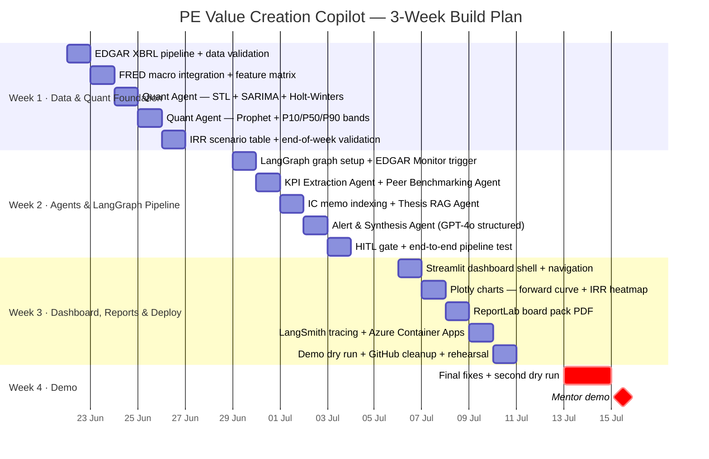

# PE Value Creation Copilot — Project Timeline

**3-week build · Week 4 = demo · 1 intern**

---

## Gantt Chart

---

## Day-by-Day Breakdown

### Week 1 — Data Foundation & Quant Engine

The quant output (P10/P50/P90 forward curves → IRR table) is the technical core of the project. It must be proven first, before building agents on top of it.

| Day | Focus | Concrete deliverable |
|---|---|---|
| **Mon** | EDGAR XBRL pipeline | Python script hits `https://data.sec.gov/api/xbrl/companyfacts/{cik}.json`; pulls Revenue, EBITDA, NetDebt, WorkingCapital for demo company; stored as clean 60-quarter `pd.DataFrame`; data quality checks pass |
| **Tue** | FRED integration | FRED API client pulling `DFF` (fed funds rate), `CPIAUCSL` (CPI), `BAA10Y` (credit spread); aligned to quarterly frequency; merged with EDGAR DataFrame as macro feature matrix |
| **Wed** | Quant Agent — Part 1 | `statsmodels` STL decomposition on EBITDA series (trend + seasonal + residual extracted); SARIMA(2,1,2) fit on trend; Holt-Winters fit; ensemble weights tuned; point forecast produces sensible output |
| **Thu** | Quant Agent — Part 2 | `prophet` model with FRED regressors added; P10/P50/P90 uncertainty quantile extraction; 20-quarter forecast horizon; uncertainty bands plotted; confidence score computed from history length |
| **Fri** | IRR scenario table | FMP/yfinance: sector EV/EBITDA multiple range pulled; entry EV computed from deal metadata; exit EBITDA = P10/P50/P90 at year 5; IRR calculated for each scenario; output validated against manual check |

**End-of-week checkpoint:** Quant engine runs on EDGAR data for a test company and produces a sensible P10/P50/P90 EBITDA chart and a bear/base/bull IRR table with numbers that make financial sense.

---

### Week 2 — Agents & LangGraph Pipeline

The quant engine from Week 1 becomes a node inside a LangGraph state machine. Remaining agents are wired in.

| Day | Focus | Concrete deliverable |
|---|---|---|
| **Mon** | LangGraph setup | `TypedDict` state schema defined (filing_metadata, kpi_series, forward_curves, irr_scenarios, peer_composite, thesis_milestones, gaps, alerts, hitl_status); LangGraph graph compiled; EDGAR Monitor with `APScheduler` running; filing type router working (10-K vs 10-Q vs 8-K paths) |
| **Tue** | KPI Extraction + Peer Benchmarking | KPI Extraction Agent as LangGraph node: fetches XBRL, computes margins and growth rates, writes to state; Peer Benchmarking Agent: SIC code lookup, fetches 10 peers (demo-scoped), computes sector medians, gap scores |
| **Wed** | Thesis RAG Agent | 3 synthetic IC memos created (PDF): revenue target, EBITDA target, leverage target per company; chunked, embedded (`text-embedding-3-large`), indexed into Azure AI Search; Thesis RAG Agent retrieves milestones; actual vs target gap % computed and written to state |
| **Thu** | Alert & Synthesis Agent | GPT-4o called with structured output schema: `{severity, summary, irr_impact_bps, corrective_action, citations[]}`; all signals (KPI gap, curve gap, thesis miss, peer underperformance) combined in prompt; severity classification tested across Red/Amber/Green cases |
| **Fri** | HITL gate + end-to-end | Streamlit modal built: shows alert card, forward curve mini-chart, thesis gap table; Approve/Edit/Reject buttons log to `audit_log.json`; full LangGraph pipeline triggered from mock 10-Q filing detection → alert card appears in Streamlit → approve → state updated |

**End-of-week checkpoint:** A mock 10-Q filing triggers the full pipeline end-to-end: XBRL pull → KPI → Quant → Peer → Thesis → Alert → HITL modal appears → approval logged. No gaps in the chain.

---

### Week 3 — Dashboard, Board Report & Deployment

Polish the output layer and ship to Azure.

| Day | Focus | Concrete deliverable |
|---|---|---|
| **Mon** | Streamlit dashboard shell | Multi-page Streamlit app: (1) Portfolio Overview — company list + latest status; (2) Company Deep Dive — filing activity timeline, metric cards, period selector; (3) Alerts feed — HITL queue; navigation and state management working |
| **Tue** | Plotly charts | Forward curve chart: historical EBITDA (solid line) + P10/P50/P90 bands (shaded) + IC milestone dots overlaid; IRR scenario heatmap (entry multiple × exit multiple → IRR colour grid); Thesis scorecard table (RAG status per KPI); Sector comparison bar chart |
| **Wed** | ReportLab board pack | Monthly board PDF generated from state: cover page, forward curve chart (saved as PNG, embedded), P10/P50/P90 IRR table, thesis milestone scorecard, sector benchmark comparison, evidence citations, HITL approval record and timestamp |
| **Thu** | Observability + deploy | LangSmith tracing: `@traceable` decorator on each agent node; token counts and latency visible in LangSmith UI; Azure Container Apps: Dockerfile written, `az containerapp up` deploys; environment variables and secrets (API keys) set via Azure Key Vault reference |
| **Fri** | Demo dry run | Full demo run against live EDGAR data; time the flow (target: < 90 seconds trigger → board report ready); fix any output formatting issues; GitHub repo cleaned up (README, requirements.txt, `.env.example`); demo script written |

**End-of-week checkpoint:** Live Azure deployment reachable at a public URL. Demo flow runs cleanly in < 2 minutes. Board PDF downloads correctly. LangSmith trace shows all agent steps.

---

### Week 4 — Demo Week

| Day | Activity |
|---|---|
| **Mon–Tue** | Two full dry runs of demo scenario. Fix any last issues. Rehearse narrative: problem → solution → live demo flow → production path → discussion questions |
| **Wed** | Mentor demo |

---

## Demo Script (2-minute flow)

> **Setup:** Dashboard open. Portfolio company selected (demo company with 8 quarters of EDGAR history). IC memo indexed.

1. **Trigger (live):** Manually call EDGAR API for a new 10-Q → pipeline fires
2. **KPI extraction:** Show raw EDGAR XBRL response → structured DataFrame (15 seconds)
3. **Forward curve:** Plotly chart loads — P10/P50/P90 EBITDA bands, IC milestone dots sitting above the P50 line *(thesis miss visible)*
4. **IRR table:** Base case IRR = 16.2% vs IC commitment of 19%. Bear case = 11.8%
5. **Alert card:** Red alert in HITL queue — "Revenue 12% below IC target. IRR at risk -280bps vs committed. Suggested lever: pricing review"
6. **HITL approval:** Click Approve → audit log entry written
7. **Board PDF:** Downloads — forward curve chart embedded, IRR table, milestone scorecard, evidence citations
8. **Close:** "In production, this runs daily, triggered by any new filing. The ingestion layer swaps from EDGAR to the firm's own board packs. Everything else is identical."

---

## Risk Register

| Risk | Likelihood | Mitigation |
|---|---|---|
| EDGAR XBRL schema varies by company (different tag names for same metric) | Medium | Use `us-gaap/Revenues` with fallback to `us-gaap/RevenueFromContractWithCustomerExcludingAssessedTax`; build tag normalisation map |
| Prophet / SARIMA produces unstable forecasts on short history (< 6 quarters) | Medium | Confidence check: if < 8 quarters, cap horizon at 2yr, add "insufficient history" warning; do not suppress — show degraded output honestly |
| Azure AI Search indexing latency on IC memo upload | Low | Index on Day 3 (Wed Week 2), run retrieval tests Thursday; buffer built in |
| Azure Container Apps cold start on demo day | Low | Keep one instance warm via a scheduled ping every 10 min; or demo from local with Azure services pointing to cloud |
| LangSmith tracing adds latency to pipeline | Low | `@traceable` is async-compatible; overhead < 50ms per node; acceptable |
